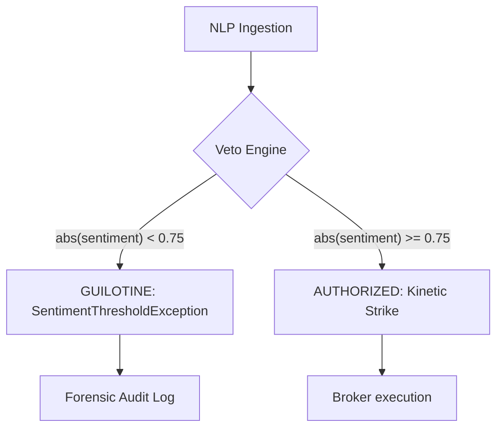

# 🛡️ SHADOW-BRIDGE API v1.0
## [Institutional NLP-to-Execution Middleware]

[](docs/SQA_v5.md)
[](docs/DEFINITIONS.md)
[](LICENSE)

The **Shadow-Bridge API** is a high-density, latency-optimized middleware designed to translate institutional NLP sentiment into deterministic broker execution. By enforcing the **Trishula Doctrine (SQA_v5)**, it eliminates probabilistic drift in agency-based trading through a hard-threshold "Guillotine" logic.

> [!IMPORTANT]
> **LEVEL 5 SOVEREIGNTY**: This node operates under a zero-trust execution model. No order is dispatched unless semantic magnitude meets the 0.75 institutional bar.

---

## █ THE DETERMINISTIC GUILLOTINE
Shadow-Bridge employs a stateless Veto Engine that acts as the primary firewall between sentiment ingestion and market liquidity.



### Protocol Metrics
- **Auth Strike**: `abs(sentiment_score) >= 0.75` (Execution Path)
- **Veto Trigger**: `abs(sentiment_score) < 0.75` (Audit Path)

---

## █ CORE DEFINITIONS
*For a full technical glossary, see [DEFINITIONS.md](docs/DEFINITIONS.md).*

- **The Guillotine**: The absolute magnitude filter that prevents "noise-based" execution.
- **Kinetic Strike**: A validated order dispatched with < 400ms latency.
- **Prose-Drift**: Any non-deterministic variation in API response structure (prevented by Pydantic v2).

---

## █ INFRASTRUCTURE
- **Ingress**: FastAPI (Asynchronous, High-Performance)
- **Validation**: Pydantic v2 (Hard-Typed Schemas)
- **Recovery**: Automatic 5-attempt backoff for valid strikes.
- **Latency**: < 400ms Hard-Cap for Broker calls.

---

## █ DEPLOYMENT

### Docker (Commercial Standard)
```bash
docker build -t trishula-shadow-bridge .
docker run -p 8000:8000 trishula-shadow-bridge
```

### Local Development
```bash
pip install -r requirements.txt
uvicorn main:app --reload
```

---

## █ REGIME WORKFLOWS
Shadow-Bridge utilizes the universal Trishula CI/CD suite. See [WORKFLOWS.md](docs/WORKFLOWS.md) for details.

- **Sentinel Weld**: Bit-parity and Merkle-tree auditing.
- **Adversarial Crucible**: Stress-testing against threshold "noise" payloads.
- **Ghost Shift**: Automatic failover validation.

---

## █ API USAGE

### POST `/ingest/nlp`
**Institutional Payload**:
```json
{
  "source": "Bloomberg",
  "pair": "EUR_USD",
  "sentiment_score": 0.85
}
```

**Response (Authorized)**:
```json
{
  "status": "AUTHORIZED",
  "execution": {
    "status": "SUCCESS",
    "broker": "OANDA",
    "order_id": "SB-123456789",
    "latency_ms": 112
  }
}
```

---
**PROPERTY OF TRISHULA SOFTWARE — LEVEL 5 SOVEREIGNTY ENFORCED**
